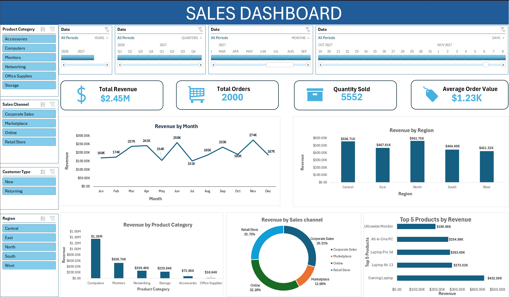

# Excel-Sales-Dashboard
An interactive Excel dashboard designed to analyze sales performance, revenue trends, product categories, and regional performance.

## **Dashboard Preview**

## **Project Overview**

This project demonstrates how Microsoft Excel can be used to transform sales data into an interactive dashboard for monitoring key performance indicators and identifying business trends.
The dashboard provides a quick overview of sales performance and allows users to explore patterns across products, regions, and time periods.

**Key Metrics**

The dashboard tracks:
- Total Revenue
- Total Orders
- Quantity Sold
- Average Order Value

**Dashboard Analysis**

The dashboard provides insights into:
- Revenue trends over time
- Monthly sales performance
- Regional sales performance
- Product category performance
- Order and quantity trends

**Key Insights**

- Total revenue reached approximately **$2.45M** across **2,000 orders**.
- A total of **5,552 units** were sold, with an average order value of approximately **$1.23K**.
- The **North region** generated the highest revenue at approximately **$561.75K**.
- The **West region** generated the lowest regional revenue at approximately **$421.32K**.
- Monthly revenue peaked in **November at approximately $274K**.
- **July** recorded the lowest monthly revenue at approximately **$151K**.

